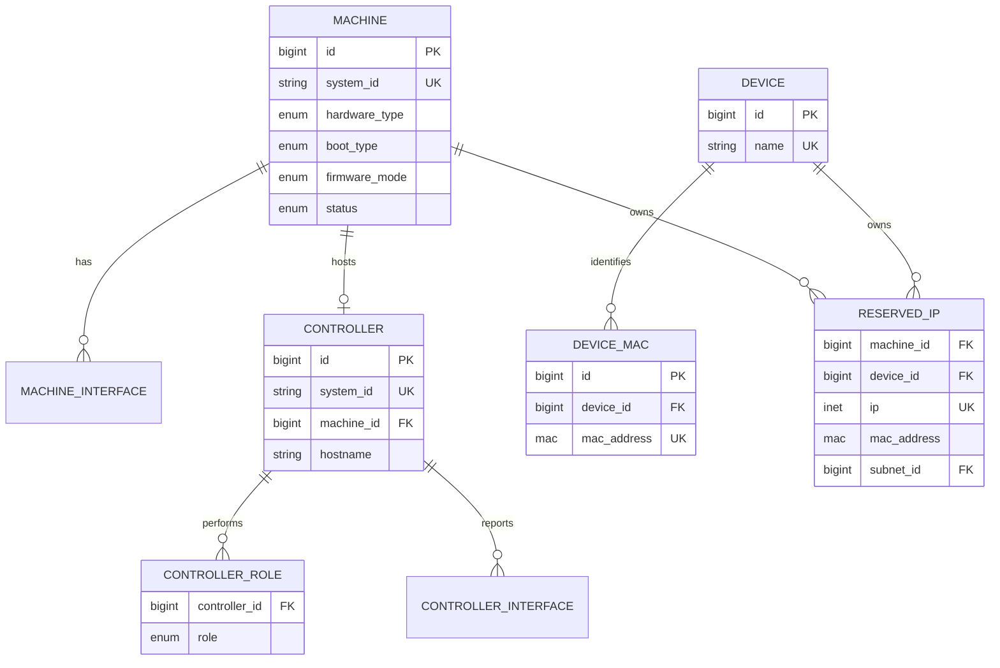

<!--
Copyright 2026 Canonical Ltd. This software is licensed under the
GNU Affero General Public License version 3 (see the file LICENSE).
-->

# Node model decomposition and switch integration

## Decision

`Node` should stop being a persistence-level union of unrelated resources.
The final model should contain three separate aggregates:

- `Machine`: deployable physical hardware. Servers, switches, and DPUs are
  hardware types of a machine.
- `Device`: a name associated with one or more MAC addresses. It exists so
  reservations and DHCP leases for otherwise unmanaged hardware have a useful
  identity.
- `Controller`: a MAAS controller installation with region and/or rack roles.
  It may be linked to the machine on which it runs, but it is not a machine.

The current `Switch` table should be folded into `Machine`. The final Django,
service-layer, and database names should be `Machine` and
`maasserver_machine`; `Node` and `maasserver_node` should disappear after the
migration.

A machine gets two independent classifications:

- `hardware_type`: `SERVER`, `SWITCH`, or `DPU`.
- `boot_type`: configured deployment boot family. The initial values should be
  `STANDARD` and `ONIE`.

`STANDARD` is preferable to calling the value `PXE`: the existing MAAS boot
path also includes UEFI HTTP/TFTP, Open Firmware, PowerNV, and s390x. A
separate observed `firmware_mode` records how the machine actually booted,
for example `LEGACY_BIOS`, `UEFI`, `OPEN_FIRMWARE`, `POWER_NV`,
`POWER_KVM`, `S390X`, `S390X_PARTITION`, or `UNKNOWN`.

This permits combinations which must remain valid:

- `SERVER + STANDARD + UEFI`
- `SWITCH + STANDARD + UEFI`
- `SWITCH + ONIE + UNKNOWN`
- `DPU + STANDARD + UEFI`

Hardware type is policy and inventory data, not a hard capability boundary.
Boot type and discovered capabilities decide which actions are supported.

## Evidence from the current model

The current state is spread across two unrelated implementations:

- `src/maasserver/models/node.py` defines one concrete `Node` table and proxy
  models for `Machine`, `Device`, and controller variants.
- `src/maasservicelayer/db/tables.py` shows that machine lifecycle, hardware,
  deployment, device identity, and controller process fields all occupy
  `maasserver_node`.
- `src/maasservicelayer/models/switches.py` and
  `src/maasservicelayer/db/tables.py` define the isolated `Switch` model with
  only `name` and `target_image_id`.
- `Interface` currently belongs either to a `NodeConfig` or directly to a
  `Switch` through `switch_id`. There is no database check enforcing exactly
  one owner.
- `src/maascommon/bootmethods.py` already contains ONIE boot metadata and a
  distinct ONIE DHCP response.
- `src/maasapiserver/v3/api/public/handlers/nos.py` serves the selected NOS
  installer by looking up a switch from its management MAC.
- `src/maascommon/osystem/onie.py` deliberately does not support
  commissioning.
- `ReservedIP` already models a fixed IP, MAC, subnet, and comment, but has no
  relationship to a machine or device.

The current controller conversion behavior is particularly strong evidence
that `node_type` combines independent concerns. Registering rackd or regiond
mutates an existing machine row into a controller row. Removing a controller
can mutate it back into a machine. Region and rack roles are encoded as three
exclusive enum values rather than two composable roles.

## Proposed aggregate model



### Machine

`Machine` owns physical inventory, desired deployment configuration, power,
storage, deployable networking, allocation, and lifecycle state. A switch is
therefore not a child table or a proxy model. It is a machine with
`hardware_type=SWITCH`.

`hardware_type` is mutually exclusive. A DPU is represented by
`hardware_type=DPU`; the current `is_dpu` boolean is removed.

All hardware types share the machine lifecycle. Actions are capability-gated:

- ONIE does not support commissioning through the current ephemeral OS path.
- Storage layout, disk erase, rescue mode, SSH commissioning, and kernel
  selection are unavailable when the selected boot path cannot implement
  them.
- A UEFI-booting switch can use the standard commissioning and deployment
  paths when its hardware supports them.

Default allocation must select only `SERVER`. `SWITCH` and `DPU` require an
explicit hardware-type constraint. This prevents accidental workload
placement without making unusual deployments impossible.

Resource pools continue to apply to every machine hardware type. The default
allocation filter, not pool membership, provides the safe server-only default.

### Switch deployment

The isolated `Switch.target_image_id` should be removed. The selected NOS uses
normal machine deployment intent:

- `osystem = "onie"`
- `distro_series = <vendor-release>`
- `architecture = <installer architecture>`

The corresponding `BootResource` is resolved in the same way as another
machine image. This avoids a second image-selection model.

The ONIE flow is:

1. An explicit deploy operation records the selected image and moves the
   switch to `DEPLOYING`.
2. ONIE receives the MAAS installer URL through DHCP.
3. MAAS serves its own small ONIE installer rather than serving the selected
   vendor payload directly.
4. The MAAS installer downloads and installs the selected payload.
5. The installer calls a deployment-scoped, authenticated, idempotent MAAS
   callback.
6. The callback moves the switch to `DEPLOYED` before reboot. This early state
   transition is accepted for the initial implementation.

Finishing the download is not deployment success. Only the callback may mark
an ONIE deployment successful. The callback credential should be one-time,
scoped to the machine and deployment attempt, and unusable after completion or
cancellation.

Existing experimental switch rows migrate to `Machine` with:

- `hardware_type=SWITCH`
- `boot_type=ONIE`
- `status=READY`
- `name` mapped to `hostname`, generating a valid unique hostname when it is
  null or invalid
- `target_image_id` translated to `osystem`, `distro_series`, and
  `architecture`

A migrated image is deployment intent only. A new deploy operation is required
before MAAS serves the installer.

### Device and reservations

A `Device` is deliberately small:

- `id`, `created`, and `updated`
- unique `name`
- one or more rows in `DeviceMAC(device_id, mac_address)`

It has no machine lifecycle, system ID, domain, zone, resource pool, tags,
owner, parent machine, power state, hardware inventory, or deployable network
configuration.

The name is an inventory/display name. DHCP lease and UI/API views should show
it when a lease MAC belongs to the device. It does not cause dynamic A/AAAA or
PTR publication.

`ReservedIP` keeps its explicit `mac_address` and gains nullable `machine_id`
and `device_id` foreign keys with this invariant:

```text
num_nonnulls(machine_id, device_id) = 1
```

Service validation must also verify that `mac_address` is known on the chosen
machine or device. Keeping the MAC on the reservation makes the reservation
stable when versioned machine interface configuration is replaced.

Creating a reservation for an unknown MAC automatically creates a Device with
a generated unique name, adds the MAC, and attaches the reservation. Existing
unowned `ReservedIP` rows migrate the same way. A later API operation may
rename or merge that generated device.

The current uniqueness rules remain useful:

- an IP is globally unique
- a MAC has at most one reservation in a subnet

Current Device migration is intentionally narrower than a field-for-field
copy:

- Create one new `Device` with the current hostname as its name.
- Copy all physical interface MACs to `DeviceMAC`.
- Convert fixed, managed IP assignments to `ReservedIP` rows owned by the
  device.
- DHCP-only links need no `ReservedIP`; the MAC-to-Device relationship is
  enough to label leases.
- External IP links do not become reservations unless they can be associated
  with a managed subnet.
- Do not carry domain, TTL, parent, zone, owner, owner-data, tags, virtual
  interfaces, or machine configuration into the new Device.
- Produce a migration report for discarded or non-convertible state. The
  migration must not silently claim that external or dynamic links are fixed
  reservations.

### Controller

`Controller` represents one MAAS installation, not its host hardware. It has
an optional unique `machine_id`, so one installation may be linked to the
managed machine on which it runs. Standalone controller installations remain
valid.

Region and rack are composable role rows:

```text
ControllerRole(controller_id, role)
UNIQUE(controller_id, role)
role IN (REGION, RACK)
```

This removes the `REGION_AND_RACK_CONTROLLER` enum value. A combined
controller simply has both rows.

A controller always owns a minimal reported runtime network model. It must not
reuse desired/deployable machine interface configuration:

- interface name and MAC
- observed addresses and VLAN/fabric attachment needed for rack selection
- neighbour and mDNS discovery state
- controller process endpoints

When `machine_id` is set, these runtime interfaces may be correlated with
machine ports by MAC, but the controller remains their source of truth. This
keeps rack reachability based on what the running controller reports rather
than what a future machine deployment intends to configure.

Controller-specific data moves with the controller:

- `url`
- `dns_process_id`
- `managing_process_id`
- `last_image_sync`
- `ControllerInfo`
- monitored `Service` rows
- region processes and endpoints
- region-to-rack RPC connections
- controller authentication credentials
- the current refresh/commissioning report pointer, renamed to reflect
  controller refresh rather than machine commissioning

A linked machine owns BMC, power, hardware inventory, storage, machine status,
and deployable network configuration. A standalone controller has no managed
hardware inventory or BMC through the Controller aggregate.

Controller and Machine keep independent, typed identities. During a split,
both may retain the old `system_id` because uniqueness is scoped to their
separate tables. Every lookup, event subject, URL, and credential must include
resource kind; a bare globally unique `system_id` assumption is no longer
valid.

For existing controller rows, the current deletion heuristic provides a useful
migration rule:

- `dynamic=true` and no BMC: create a standalone Controller.
- otherwise: create both Controller and linked Machine.

This mirrors the current `should_be_dynamically_deleted()` distinction between
an auto-created controller and a row MAAS should preserve as a machine.

## Current `maasserver_node` column disposition

The table below covers every current physical column plus the separate tags
relation.

| Current column | Final owner | Disposition |
|---|---|---|
| `id` | Machine / Device / Controller | Each aggregate gets its own primary key. |
| `created` | Machine / Device / Controller | Duplicate timestamps; no common base table is required. |
| `updated` | Machine / Device / Controller | Duplicate timestamps. |
| `system_id` | Machine / Controller | Remove from Device; uniqueness is per typed table. |
| `hostname` | Machine / Controller / Device | Machine and Controller retain hostname; Device maps it to `name`. |
| `description` | Machine / Controller | Preserve controller annotations separately; Device drops it. |
| `hardware_uuid` | Machine | Physical hardware identity. |
| `node_type` | none | Remove. Machine gets `hardware_type`; controller roles use rows. |
| `is_dpu` | none | Backfill `hardware_type=DPU`, then remove. |
| `status` | Machine | Machine lifecycle only. Controller health comes from services/connectivity. |
| `previous_status` | Machine | Machine FSM history. |
| `status_expires` | Machine | Machine FSM timeout. |
| `error_description` | Machine | Machine lifecycle failure detail. |
| `error` | Machine | Machine operational/deployment error. Consolidate with structured failure data later. |
| `owner_id` | Machine | Allocation owner. Current controller worker ownership and Device ownership disappear. |
| `agent_name` | Machine | Allocation/deployment agent selection. |
| `pool_id` | Machine | Applies to all hardware types; allocation defaults still select servers only. |
| `zone_id` | Machine / Controller | Separate physical placement values; Device drops zone. |
| `domain_id` | Machine / Controller | Separate DNS identity values; Device has no domain. |
| `address_ttl` | Machine / Controller | Preserve only for their DNS records; Device lease labels do not publish DNS. |
| `parent_id` | Machine | Rename to `parent_machine_id` and restrict to composed/virtual machine lineage. Device parent semantics disappear. |
| `cpu_count` | Machine | Hardware inventory. May be unknown for uncommissioned ONIE machines. |
| `cpu_speed` | Machine | Hardware inventory. |
| `memory` | Machine | Hardware inventory. |
| `architecture` | Machine | Image and hardware architecture, including switches and DPUs. |
| `bmc_id` | Machine | Power belongs to host hardware, not a controller installation. |
| `instance_power_parameters` | Machine | Machine-specific power driver data. |
| `power_state` | Machine | Physical host state. |
| `power_state_queried` | Machine | Power polling coordination. |
| `power_state_updated` | Machine | Last observed physical power state. |
| `bios_boot_method` | Machine | Split into configured `boot_type` and observed `firmware_mode`. |
| `netboot` | Machine | Machine boot policy; rename later only if semantics are changed. |
| `boot_interface_id` | Machine | Point to the machine hardware/config network model, never Controller runtime interfaces. |
| `boot_cluster_ip` | Machine | Transient boot routing information. Valid for either standard or ONIE paths if needed. |
| `gateway_link_ipv4_id` | Machine | Desired deployed networking. |
| `gateway_link_ipv6_id` | Machine | Desired deployed networking. |
| `osystem` | Machine | Deployment intent; ONIE uses `onie`. |
| `distro_series` | Machine | Deployment release; ONIE uses vendor/release. |
| `min_hwe_kernel` | Machine | Standard boot/deployment capability only. |
| `hwe_kernel` | Machine | Standard boot/deployment capability only. |
| `default_user` | Machine | Deployed OS configuration. |
| `swap_size` | Machine | Deployed OS/storage configuration. |
| `boot_disk_id` | Machine | Physical/deployment storage. Unsupported actions are gated for ONIE. |
| `license_key` | Machine | Selected deployed OS data. |
| `ephemeral_deploy` | Machine | Deployment behavior; unavailable where the boot type cannot support it. |
| `enable_kernel_crash_dump` | Machine | Deployed OS behavior. |
| `enable_ssh` | Machine | Commissioning option, gated by boot capability. |
| `skip_networking` | Machine | Commissioning/deployment option. |
| `skip_storage` | Machine | Commissioning/deployment option. |
| `locked` | Machine | Protects deployed machine configuration. |
| `last_applied_storage_layout` | Machine | Machine storage state. |
| `current_config_id` | Machine | Machine configuration pointer; align it with the separate network-model refactor. |
| `current_commissioning_script_set_id` | Machine / Controller | Machine keeps commissioning; Controller gets a separately named refresh pointer. |
| `current_installation_script_set_id` | Machine | Machine installation lifecycle. |
| `current_testing_script_set_id` | Machine | Machine testing lifecycle. |
| `current_release_script_set_id` | Machine | Machine release lifecycle. |
| `current_deployment_script_set_id` | Machine | Machine deployment lifecycle, including ONIE callback results. |
| `enable_hw_sync` | Machine | Deployed OS hardware synchronization. |
| `sync_interval` | Machine | Hardware synchronization configuration. |
| `last_sync` | Machine | Hardware synchronization state. |
| `dynamic` | Machine / Controller | Replace with explicit fields such as Machine creation origin and Controller auto-registration; do not retain the overloaded boolean. |
| `url` | Controller | Rack controller callback/base URL. |
| `dns_process_id` | Controller | Region controller process assignment. |
| `managing_process_id` | Controller | Rack controller process assignment. |
| `last_image_sync` | Controller | Rack image synchronization state. |
| `tags` relation | Machine | Hardware/allocation tags. Copy controller tags to its linked Machine when present; Device and standalone Controller tags are not retained. |

## Related tables and call sites that must move

Removing `node_type` is not only a table migration. The following relationships
encode the same union and must be made typed:

### Machine-only

- `NodeConfig`, block devices, filesystems, NUMA nodes, hardware devices, and
  machine network configuration
- BMC and instance power parameters
- machine owner data and deployment user data
- commissioning, testing, installation, release, and deployment script runs
- resource pools and allocation queries

### Controller-only

- `ControllerInfo`
- `Service`
- `RegionControllerProcess` and process endpoints
- `RegionRackRPCConnection`
- VLAN primary/secondary rack relationships
- controller refresh credentials and refresh results
- rack neighbour/mDNS observations

### Typed subjects

These currently point to `Node` but legitimately concern more than one new
aggregate. They need an explicit resource kind plus typed relationship, or
separate tables where referential integrity is more important:

- events and audit records
- authentication credentials currently represented by `NodeKey`
- DHCP snippets scoped to a machine or controller
- DNS hostname/IP mappings that currently carry `node_type`
- websocket/database notification triggers

Avoid a replacement generic `Asset` table solely to keep these foreign keys.
That would recreate `Node` under another name. Typed subject IDs at logging and
API boundaries are preferable; operational tables should use real foreign
keys to their owning aggregate.

## Interaction with the network model refactor

The separate network design in `new-switch-model/NETWORK-MODEL.md` divides
hardware ports, physical fabric configuration, and deployment configuration.
The aggregate split should follow that boundary:

- Server, switch, and DPU ports use the same Machine hardware layer.
- Machine port/deploy configuration remains versioned with machine
  configuration.
- Device MACs do not use the full machine Interface model.
- Controller runtime interfaces do not use machine deployment configuration.

As an interim migration, an isolated switch Interface can move from
`switch_id` to the new Machine's `NodeConfig`. In the final network model its
MAC and hardware data become Machine network ports. Once all switches are
migrated, remove `Interface.switch_id` and the isolated `Switch` table.

## Migration sequence

Each phase has one source of truth after cutover. Long-lived dual writes should
not be used.

1. **Add typed schemas**
   - Add Machine classification and boot fields.
   - Add Device, DeviceMAC, Controller, ControllerRole, and controller runtime
     network tables.
   - Add typed reservation ownership and constraints.
2. **Migrate machines and switches**
   - Backfill existing machine rows to `SERVER` or `DPU`.
   - Convert Switch rows to `SWITCH + ONIE + READY` machines.
   - Translate switch image and interface data.
   - Cut switch APIs and NOS lookup to Machine.
3. **Migrate devices and reservations**
   - Create minimal Device/DeviceMAC rows.
   - Convert managed fixed links to owned ReservedIP rows.
   - Auto-create generated Devices for existing reservation MACs with no
     owner.
   - Cut DHCP lease decoration to Device/Machine ownership.
4. **Extract controllers**
   - Create role rows and controller runtime network records.
   - Create linked Machines using the dynamic/BMC heuristic.
   - Repoint controller process, service, VLAN, refresh, and RPC data.
   - Cut registration from node-type mutation to Controller upsert plus
     optional Machine linking.
5. **Cut typed dependencies**
   - Replace generic Node foreign keys, `node_type` filters, proxy casts,
     permissions, DNS mappings, events, and notifications.
   - Rename the final machine model/table.
   - Remove `node_type`, `is_dpu`, proxy classes, Switch persistence,
     `Interface.switch_id`, and the old Node table/model.

Migration verification must compare counts and identities by resource kind,
not only total Node rows. It must also report every Device link, tag,
owner-data entry, external IP, and virtual interface that is intentionally not
represented by the new minimal Device.

## API consequences

- `/machines` is the canonical collection for every hardware type and exposes
  `hardware_type`, `boot_type`, and observed `firmware_mode`.
- Allocation without a hardware-type selector considers only servers.
- `/switches` may remain a filtered API view over Machine, but it must not have
  separate persistence. The current v3 endpoint is explicitly experimental,
  so its ID and response contract can move to Machine semantics.
- `/devices` exposes only device ID, name, and MACs. Reservation and lease APIs
  expose the typed owner.
- `/controllers` exposes Controller identity, roles, health, runtime
  interfaces, and optional linked Machine.
- A generic `/nodes` response can only be an API compatibility projection. It
  must not drive a generic domain model or database table. Removing fields from
  the established v2 Device contract requires an explicit API compatibility
  decision even though persistence is cleanly separated.

## Required invariants

- Every Machine has exactly one hardware type and one configured boot type.
- `is_dpu` and `node_type` do not survive the final schema.
- Hardware type does not implicitly select firmware or deployment image.
- Default allocation cannot return a switch or DPU.
- Explicit allocation may return a requested switch or DPU when all other
  constraints match.
- An ONIE deployment reaches `DEPLOYED` only through its authenticated success
  callback.
- Every Device has at least one unique MAC.
- Every ReservedIP has exactly one Machine or Device owner, and its MAC belongs
  to that owner.
- Every Controller has at least one role.
- A Machine hosts at most one Controller installation.
- Controller runtime interfaces never become machine desired deployment
  configuration implicitly.
- Resource kind is required anywhere a reused `system_id` crosses aggregate
  boundaries.

## Behavioral checks for implementation

- Migrate a normal machine, DPU, standalone rack, linked region+rack, and
  isolated switch without losing their typed identity.
- Verify a UEFI switch uses the standard machine deployment path.
- Verify an ONIE switch receives the MAAS wrapper, installs its selected image,
  and becomes deployed only after callback.
- Verify default allocation excludes SWITCH and DPU while explicit constraints
  can select each.
- Verify a DHCP-only Device lease displays the Device name without creating DNS
  records.
- Verify a raw-MAC reservation auto-creates and owns a generated Device.
- Verify reservation ownership survives replacement of a machine's versioned
  interface configuration.
- Verify a combined controller is represented by two roles, not a combined
  enum.
- Verify controller registration no longer changes Machine hardware type or
  lifecycle state.
- Verify migration reports every intentionally discarded legacy Device field
  or link.
