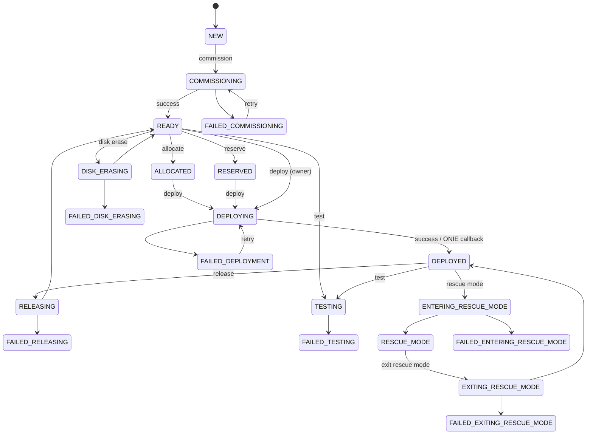
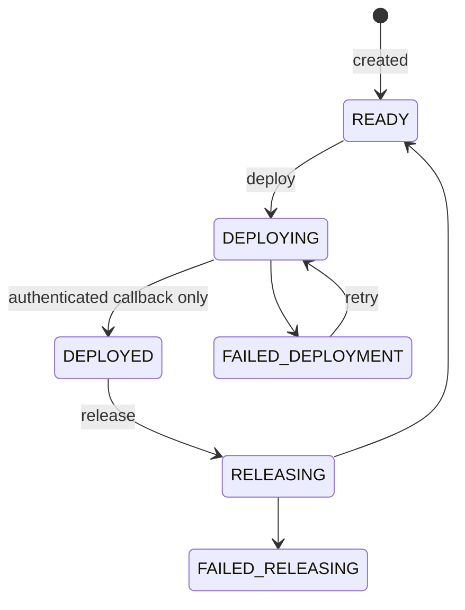
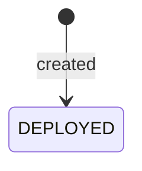
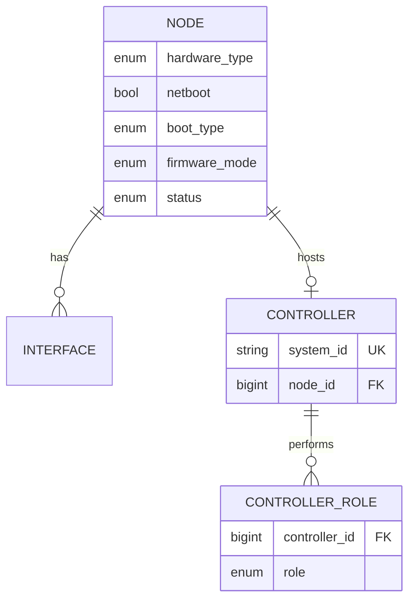

<!--
Copyright 2026 Canonical Ltd. This software is licensed under the
GNU Affero General Public License version 3 (see the file LICENSE).
-->

# Node model: hardware assets, boot capability, and controller extraction

## Decision

`Node` remains the table of managed hardware assets. It is not split into
separate Machine and Device persistence. Instead, the node table is
re-centered on the one property all managed hardware shares: **it is a
physical (or virtual) piece of hardware about which MAAS can hold inventory**.

Four hardware types cover everything MAAS manages:

- `SERVER`: general-purpose deployable machine.
- `DPU`: deployable data processing unit.
- `SWITCH`: network switch.
- `DEVICE`: general device; primarily a DHCP/DNS identity, but a hardware
  asset like any other.

The current `Switch` table is folded into `Node` as `hardware_type=SWITCH`.
`Device` stays in the node table. `Controller` is the only occupant that
leaves: a controller is a MAAS installation, not hardware. It moves to its
own table and links back to the node whose hardware it runs on — which may
be a server, a device, a switch, or a DPU.

Two orthogonal classifications replace the overloaded `node_type`:

- `hardware_type`: `SERVER`, `DPU`, `SWITCH`, or `DEVICE`. What the hardware
  is. Inventory and policy data, not a hard capability boundary.
- Boot capability: whether the node can network boot at all (`netboot`),
  and if so through which boot family (`boot_type`: `STANDARD` or `ONIE`).
  `STANDARD` names the existing UEFI/PXE family, which in practice also
  covers UEFI HTTP/TFTP, Open Firmware, PowerNV, and s390x. A separate
  observed `firmware_mode` records how the node actually booted
  (`UEFI`, `LEGACY_BIOS`, `OPEN_FIRMWARE`, `POWER_NV`, `S390X`, …,
  `UNKNOWN`).

Operations are gated on boot capability, not hardware type. Commissioning,
rescue mode, and hardware testing require the ephemeral environment, which
only `STANDARD` boot provides. Deployment works for both `STANDARD` and
`ONIE`. Hardware information collection works for every node, with or
without network boot.

## Changes from the previous proposal

- `Device` stays in the node table instead of becoming a minimal external
  name+MAC aggregate. It gains the ability to hold hardware information.
- No separate `Machine` table. `maasserver_node` survives as the hardware
  asset table; `node_type` and `is_dpu` do not.
- Hardware information collection becomes a first-class, source-agnostic
  capability of every node rather than a side effect of commissioning.
- `Controller` is still extracted, but now links to a node of any hardware
  type for its hardware inventory instead of coexisting as a node type.
- The ReservedIP/DeviceMAC redesign is dropped; device addressing keeps the
  existing Interface/StaticIPAddress machinery.

## Evidence from the current model

- `src/maasserver/models/node.py` defines one concrete `Node` table plus
  proxy models for `Machine`, `Device`, and the controller variants.
  Registering rackd/regiond mutates an existing row's `node_type`; removal
  can mutate it back. Region and rack roles are encoded as the exclusive
  enum values `REGION_CONTROLLER`, `RACK_CONTROLLER`, and
  `REGION_AND_RACK_CONTROLLER` (`maascommon/enums/node.py`) instead of two
  composable roles.
- `src/maasservicelayer/db/tables.py` shows lifecycle, hardware inventory,
  commissioning options, deployment intent, and controller process fields
  all occupying `maasserver_node` (full inventory below).
- `src/maasservicelayer/models/switches.py` defines the isolated `Switch`
  model with only `name` and `target_image_id`; `Interface` links to it via
  `switch_id` with no database constraint enforcing a single owner.
- `src/maascommon/osystem/onie.py` supports the `XINSTALL` purpose only and
  explicitly returns no commissioning releases.
- `src/maascommon/bootmethods.py` already carries ONIE boot metadata and a
  distinct ONIE DHCP response; `maasapiserver/v3/api/public/handlers/nos.py`
  serves the selected NOS installer looked up by management MAC.
- Controllers already report hardware information without being deployed by
  MAAS: the controller "refresh" path runs commissioning scripts on the
  controller host and stores the result pointer on the node row
  (`current_commissioning_script_set_id`). This is hardware collection
  without commissioning in everything but name.
- `should_be_dynamically_deleted()` in `node.py` is the existing heuristic
  distinguishing an auto-created controller row from hardware MAAS should
  keep; it provides the migration rule for splitting controllers.

## Hardware types and capabilities

| Capability | Server | DPU | Switch | Device |
|---|---|---|---|---|
| Network boot | `STANDARD` | `STANDARD` | `ONIE`, `STANDARD`, or none | no |
| Commission / rescue / test | yes | yes | only with `STANDARD` | no |
| Deploy | yes | yes | yes | no |
| Hardware information | all sources | all sources | agent, post-deploy sync, commissioning if `STANDARD` | agent |
| Power management | yes | yes | optional | optional |
| Default allocation | yes | explicit constraint only | explicit constraint only | never allocated |

Valid combinations include `SERVER+STANDARD+UEFI`, `DPU+STANDARD+UEFI`,
`SWITCH+ONIE+UNKNOWN`, `SWITCH+STANDARD+UEFI` (a switch that can netboot the
ephemeral image gets the full commissioning path), and `DEVICE` with no
boot capability.

Hardware type never implicitly selects firmware or image. Boot type and
discovered capabilities decide which actions are offered.

## Hardware information collection

Hardware inventory is decoupled from commissioning. Every node may carry
inventory — CPU, memory, block devices, NUMA nodes, hardware devices,
network ports — regardless of `hardware_type`. These tables already hang off
`Node` through `NodeConfig`, so no schema barrier exists today; the barrier
is only that collection is wired to commissioning. What differs per node is
the collection source:

1. **Commissioning** — the ephemeral environment over `STANDARD` boot.
   Richest source; requires network boot. Servers, DPUs, and the rare
   UEFI-booting switch.
2. **Deployed-OS synchronization** — the existing `enable_hw_sync` /
   `sync_interval` / `last_sync` machinery, where the deployed workload
   periodically reports hardware state. Applies to deployed servers, DPUs,
   and switches running a NOS that can host the reporting component.
3. **On-device agent push** — an agent running on the hardware itself
   collects inventory and sends it to MAAS. This is the only source
   available for ONIE-only switches that are never deployed, for
   controllers, and for general devices. The controller refresh path is
   the existing precedent and becomes a special case of this source.

Consequences:

- The schema does not restrict inventory tables by hardware type. A device
  or switch with no reported inventory simply has empty inventory; a node
  with an agent reports like anything else.
- `enable_hw_sync`, `sync_interval`, and `last_sync` generalize from
  "deployed OS sync" to per-node collection state shared by sources 2
  and 3.
- A controller's hardware information lives on its linked node. The
  controller aggregate itself holds no inventory.
- Collection must record provenance per report (source and timestamp) so a
  commissioning report and an agent report for the same node are not
  silently treated as equivalent. Exact provenance modeling is left to the
  implementation.

## Boot model

- `netboot` (existing column) records whether the node may network boot.
  `hardware_type=DEVICE` implies `netboot=false`.
- `boot_type` is the configured boot family: `STANDARD` or `ONIE`, null
  when `netboot=false`. It replaces the configured half of
  `bios_boot_method`.
- `firmware_mode` is observed, not configured: how the node actually
  booted last (`UEFI`, `LEGACY_BIOS`, `OPEN_FIRMWARE`, `POWER_NV`,
  `POWER_KVM`, `S390X`, `S390X_PARTITION`, `UNKNOWN`).
- Capability gating:
  - Commissioning, rescue mode, memory/disk testing, SSH commissioning:
    `boot_type=STANDARD` only.
  - Deployment: `STANDARD` or `ONIE`.
  - Storage layout, disk erase, kernel selection: unavailable when the
    boot path cannot implement them (ONIE installs a vendor payload; MAAS
    does not manage its disks).

## Lifecycle states per hardware type

The status vocabulary (`NodeStatus` in `maascommon/enums/node.py`) is
shared, but each hardware type only exercises a subset. The full lifecycle
below applies to servers and DPUs; the tables and variant diagrams after it
show the reachable subsets. `BROKEN`, `RETIRED`, and `MISSING` are omitted
from the diagrams for readability: they are administrative or
monitoring-driven and reachable from any steady state of the types that
allow them.

Full lifecycle (`SERVER`, `DPU`, and `SWITCH` with `boot_type=STANDARD`):



Testing returns the node to its prior steady state (`READY` or
`DEPLOYED`); the diagram shows the entry edges only.

`SWITCH` with `boot_type=ONIE` — every state requiring the ephemeral
environment is unreachable; deployment and release remain. The switch is
created explicitly (with its target image), so it skips `NEW`:



`DEVICE`, and `SWITCH` with `netboot=false` — the lifecycle is
intentionally degenerate. Neither is discovered into MAAS (discovered
hardware is tracked elsewhere, e.g. as observed DHCP leases), and neither
can be deployed, so `READY` ("deployable, waiting in the pool") would be a
lie. They are created directly in `DEPLOYED`, which for a non-deployable
node reads as "in service": its operational steady state, on which MAAS
performs no lifecycle transitions. This also makes the hardware-collection
model uniform: agent and deployed-OS reporting key off `DEPLOYED`, so a
device or unmanaged switch with a collection agent looks exactly like a
deployed server with hw-sync enabled.



Allowed status values per hardware type:

| Status family | Values | Server | DPU | Switch (STANDARD) | Switch (ONIE) | Switch (no netboot) | Device |
|---|---|---|---|---|---|---|---|
| Enlistment | `NEW` | yes | yes | yes | no | no | no |
| Commissioning | `COMMISSIONING`, `FAILED_COMMISSIONING` | yes | yes | yes | no | no | no |
| Testing | `TESTING`, `FAILED_TESTING` | yes | yes | yes | no | no | no |
| Availability | `READY` | yes | yes | yes | yes | no | no |
| Allocation | `RESERVED`, `ALLOCATED` | yes | yes | yes | yes | no | no |
| Deployment | `DEPLOYED` | yes | yes | yes | yes | yes | yes |
| Deployment (transitional) | `DEPLOYING`, `FAILED_DEPLOYMENT` | yes | yes | yes | yes | no | no |
| Release | `RELEASING`, `FAILED_RELEASING` | yes | yes | yes | yes | no | no |
| Disk erase | `DISK_ERASING`, `FAILED_DISK_ERASING` | yes | yes | yes | no | no | no |
| Rescue mode | `ENTERING_RESCUE_MODE`, `RESCUE_MODE`, `EXITING_RESCUE_MODE`, `FAILED_ENTERING_RESCUE_MODE`, `FAILED_EXITING_RESCUE_MODE` | yes | yes | yes | no | no | no |
| Administrative | `RETIRED`, `BROKEN` | yes | yes | yes | yes | yes | no |
| Monitoring | `MISSING` | yes | yes | yes | yes | yes | no |

Rules encoded above:

- The commissioning, testing, disk-erase, and rescue-mode families require
  `boot_type=STANDARD`, because all of them boot the ephemeral environment.
- `NEW` marks discovered or enlisted hardware pending action. Explicitly
  created nodes never pass through it: an ONIE switch is created in
  `READY`; a device or non-bootable switch is created in `DEPLOYED`.
- An ONIE switch transitions to `DEPLOYED` only through the authenticated
  deployment callback and skips commissioning entirely.
- A node with `netboot=false` stays in `DEPLOYED` for its entire lifetime.
  For a device, administrative removal is deletion, not `RETIRED`, and MAAS
  does not monitor it (`MISSING` does not apply). A non-bootable switch
  with a collection agent is monitored and can be `MISSING`, `BROKEN`, or
  `RETIRED`.

## Switch integration and ONIE deployment

The isolated `Switch` table and `Interface.switch_id` are removed. A switch
is a node with `hardware_type=SWITCH`. `Switch.target_image_id` is replaced
by normal deployment intent on the node:

- `osystem = "onie"`
- `distro_series = <vendor-release>`
- `architecture = <installer architecture>`

The ONIE flow is unchanged from the previous proposal:

1. An explicit deploy operation records the selected image and moves the
   switch to `DEPLOYING`.
2. ONIE receives the MAAS installer URL through DHCP.
3. MAAS serves its own small ONIE installer, which downloads and installs
   the selected vendor payload.
4. The installer calls a deployment-scoped, authenticated, idempotent
   callback; only that callback moves the switch to `DEPLOYED`. The
   credential is one-time, scoped to the node and deployment attempt, and
   unusable after completion or cancellation.

Existing experimental switch rows migrate to nodes with
`hardware_type=SWITCH`, `boot_type=ONIE`, `status=READY`, `name` mapped to a
valid unique hostname, and `target_image_id` translated to deployment
intent. A new deploy operation is still required before MAAS serves the
installer.

After deployment (or without any deployment), a switch running the
collection agent reports hardware information through source 3 above.

## Controller extraction

`Controller` represents one MAAS installation. New tables:

```text
Controller(id, created, updated, system_id, hostname, node_id FK NULL UNIQUE, ...)
ControllerRole(controller_id FK, role)  UNIQUE(controller_id, role), role IN (REGION, RACK)
```

- `node_id` optionally and uniquely links the installation to the hardware
  it runs on — any hardware type. A region+rack installation on a managed
  server links to that server; an installation on an unmanaged host links
  to a device-type node or to nothing. One node hosts at most one
  controller.
- The `REGION_AND_RACK_CONTROLLER` enum value disappears; a combined
  controller has two role rows.
- Controller-owned data moves out of the node table: `url`,
  `dns_process_id`, `managing_process_id`, `last_image_sync`,
  `ControllerInfo`, monitored `Service` rows, region processes and
  endpoints, region-to-rack RPC connections, VLAN primary/secondary rack
  relationships, and controller authentication credentials.
- The controller's reported runtime network view (interface name/MAC,
  observed addresses, neighbour and mDNS discovery, process endpoints)
  stays with the controller and never reuses the node's desired/deployable
  network configuration. Rack reachability is based on what the running
  controller reports.
- Hardware inventory belongs to the linked node, collected by the
  controller's own agent (today: the refresh path). Standalone controllers
  with no linked node hold no inventory.
- Registration stops mutating `node_type`. It becomes a Controller upsert
  plus an optional link to an existing or newly created node.
- Controller and Node keep independent identities; a link may retain the
  old `system_id` on both sides because uniqueness is scoped per table.
  Any lookup, event subject, URL, or credential crossing the boundary must
  carry the resource kind.

Migration of existing controller rows follows the current deletion
heuristic: `dynamic=true` with no BMC becomes a standalone Controller;
otherwise the row becomes a Controller linked to its (now hardware-typed)
node.

## Current `maasserver_node` column inventory

Ground truth: `NodeTable` in `src/maasservicelayer/db/tables.py`. Columns
are grouped by concern. Commissioning and deployment groups are listed
separately as extraction candidates; the extraction mechanism (satellite
tables vs. retained columns) is deliberately left open.

### Identity and classification — stays on Node

| Column | Notes |
|---|---|
| `id`, `created`, `updated` | — |
| `system_id` | Unique per node. |
| `hostname` | Unique. |
| `description` | — |
| `domain_id`, `address_ttl` | DNS identity. |
| `hardware_uuid` | Physical hardware identity. |
| `node_type` | Replaced by `hardware_type`; removed after migration. |
| `is_dpu` | Folded into `hardware_type=DPU`; removed. |
| `parent_id` | VM/container host lineage. |
| `zone_id` | Physical placement. |
| `pool_id` | Resource pool; allocation default still selects servers only. |
| tags relation | Hardware/allocation tags. |

### Lifecycle and allocation — stays on Node

| Column | Notes |
|---|---|
| `status`, `previous_status`, `status_expires` | Lifecycle FSM; meaningful mainly for bootable/deployable types, trivial for devices. |
| `error_description`, `error` | Failure detail. |
| `owner_id`, `agent_name` | Allocation owner and deployment agent. |
| `locked` | Protects deployed configuration. |
| `dynamic` | Overloaded (auto-created controller vs. discovered hardware). Replace with explicit creation-origin field during controller extraction. |

### Power — stays on Node

| Column | Notes |
|---|---|
| `bmc_id`, `instance_power_parameters` | Any hardware type may have power control. |
| `power_state`, `power_state_queried`, `power_state_updated` | — |

### Hardware inventory and collection state — stays on Node, generalized

| Column | Notes |
|---|---|
| `cpu_count`, `cpu_speed`, `memory` | Now valid for every hardware type; may be unknown until a collection source reports. |
| `architecture` | Image and hardware architecture. |
| `current_config_id` | Versioned network/hardware configuration pointer. |
| `enable_hw_sync`, `sync_interval`, `last_sync` | Generalize from deployed-OS sync to collection state shared by agent and deployed-OS sources. |

### Boot capability — stays on Node

| Column | Notes |
|---|---|
| `netboot` | Whether the node may network boot. |
| `bios_boot_method` | Split into configured `boot_type` (`STANDARD`/`ONIE`) and observed `firmware_mode`. |
| `boot_interface_id` | Interface used for network boot. |
| `boot_cluster_ip` | Transient boot routing information. |

### Commissioning-related — extract (mechanism TBD)

Meaningful only for `boot_type=STANDARD`; NULL/ignored otherwise.

| Column | Notes |
|---|---|
| `enable_ssh` | SSH into the ephemeral environment. |
| `skip_networking` | Skip network configuration during commissioning. |
| `skip_storage` | Skip storage configuration during commissioning. |
| `current_commissioning_script_set_id` | Commissioning run pointer. The controller refresh use of this column moves to the controller's linked node as an agent report. |
| `current_testing_script_set_id` | Hardware testing run pointer. |

### Deployment-related — extract (mechanism TBD)

Meaningful for deployable types; `osystem`/`distro_series`/`architecture`
double as the ONIE image selector for switches.

| Column | Notes |
|---|---|
| `osystem`, `distro_series` | Deployment intent; ONIE uses `onie` + vendor-release. |
| `hwe_kernel` | Deployed kernel selection. |
| `min_hwe_kernel` | Hardware kernel floor; constrains commissioning kernel choice too. |
| `license_key` | Selected OS data. |
| `default_user` | Deployed OS user. |
| `swap_size` | Deployed storage configuration. |
| `ephemeral_deploy` | Deploy-to-RAM behavior; `STANDARD` only. |
| `enable_kernel_crash_dump` | Deployed OS behavior. |
| `boot_disk_id` | Deployment storage; not managed for ONIE. |
| `gateway_link_ipv4_id`, `gateway_link_ipv6_id` | Desired deployed networking. |
| `last_applied_storage_layout` | Storage state. |
| `current_installation_script_set_id` | Installation run pointer. |
| `current_release_script_set_id` | Release run pointer. |
| `current_deployment_script_set_id` | Deployment run pointer, including ONIE callback results. |

### Controller-related — moves to the Controller table

| Column | Notes |
|---|---|
| `url` | Controller callback/base URL. |
| `dns_process_id` | DNS process assignment. |
| `managing_process_id` | Rack process assignment. |
| `last_image_sync` | Rack image synchronization state. |

### Resulting node table

After removing controller fields and grouping commissioning/deployment
concerns, the node table holds only what every hardware asset shares:

```text
Node:
  id, created, updated
  system_id, hostname, description
  hardware_type            # SERVER | DPU | SWITCH | DEVICE
  domain_id, address_ttl, zone_id, pool_id, parent_id
  status, previous_status, status_expires, error, error_description
  owner_id, agent_name, locked
  hardware_uuid, cpu_count, cpu_speed, memory, architecture
  enable_hw_sync, sync_interval, last_sync
  bmc_id, instance_power_parameters
  power_state, power_state_queried, power_state_updated
  netboot, boot_type, firmware_mode, boot_interface_id, boot_cluster_ip
  current_config_id
  + commissioning group (STANDARD only)
  + deployment group (deployable types)
```

## Proposed model



## Related tables and call sites that must move

Node-side (unchanged ownership, now shared by all hardware types):

- `NodeConfig`, interfaces, block devices, filesystems, NUMA nodes,
  hardware devices
- BMC and power parameters
- owner data and deployment user data
- commissioning, testing, installation, release, deployment script sets
  (gated by boot capability)
- resource pools and allocation queries

Controller-side (new ownership):

- `ControllerInfo`, `Service`, `RegionControllerProcess` and endpoints,
  `RegionRackRPCConnection`, VLAN rack relationships, controller
  credentials, runtime interface/neighbour observations

Typed subjects — these point at `Node` today and concern both nodes and
controllers. They need an explicit resource kind plus typed relationship:

- events and audit records
- `NodeKey` authentication credentials
- DHCP snippets scoped to a machine or controller
- DNS hostname/IP mappings that currently carry `node_type`
- websocket/database notification triggers

No generic `Asset` replacement table: that recreates `Node`'s union problem
for controllers. Typed subject IDs at logging/API boundaries; real foreign
keys in operational tables.

## Migration sequence

Each phase ends with one source of truth; no long-lived dual writes.

1. **Classify nodes**
   - Add `hardware_type`, `boot_type`, `firmware_mode`.
   - Backfill from `node_type` (`MACHINE`→`SERVER`, `DEVICE`→`DEVICE`,
     controllers keep their type until phase 3) and `is_dpu` (→`DPU`).
   - Derive `boot_type` from `bios_boot_method`/`netboot`.
2. **Fold in switches**
   - Convert Switch rows to `SWITCH + ONIE + READY` nodes; translate image
     and interface data; drop `Interface.switch_id` and the Switch table.
   - Cut switch APIs and NOS lookup to Node.
3. **Generalize hardware collection**
   - Add the agent ingestion path with provenance; enable it for switches,
     devices, and controller hosts.
   - Retarget controller refresh results to the linked node.
4. **Extract controllers**
   - Create Controller/ControllerRole and controller runtime tables.
   - Split rows using the dynamic/BMC heuristic; repoint process, service,
     VLAN, RPC, and credential data.
   - Cut registration to Controller upsert plus optional node link.
5. **Remove the union**
   - Drop `node_type`, `is_dpu`, proxy models, and controller leftovers on
     the node table.
   - Replace `node_type` filters, permissions, DNS mappings, events, and
     notifications with typed lookups.

Verification compares counts and identities per resource kind, not total
node rows.

## API consequences

- `/machines`, `/devices`, `/switches` are filtered views over the node
  table; only `/switches` is new in this respect (its v3 endpoint is
  experimental, so its contract may move).
- Device responses may include hardware inventory when a collection agent
  has reported it; the DHCP/DNS behavior of devices is unchanged.
- `/controllers` exposes installation identity, roles, health, runtime
  interfaces, and the optional linked node.
- Hardware inventory endpoints accept any node type; absence of inventory
  is not an error.
- Allocation without a hardware-type constraint considers only `SERVER`.
- A generic `/nodes` response is an API compatibility projection only; it
  must not drive a generic domain model.

## Required invariants

- Every node has exactly one `hardware_type`.
- `netboot=false` implies no `boot_type`; `netboot=true` implies
  `boot_type IN (STANDARD, ONIE)`.
- `hardware_type=DEVICE` implies `netboot=false`.
- `NEW` is reachable only through discovery/enlistment; explicitly created
  nodes are never in `NEW`.
- A node with `netboot=false` is created in `DEPLOYED` and remains there
  for its entire lifetime.
- Commissioning, testing, disk-erase, and rescue-mode statuses are
  unreachable unless `boot_type=STANDARD`; an ONIE switch's lifecycle is
  limited to enrolment, allocation, deployment, release, and the
  administrative/monitoring states.
- Commissioning, rescue mode, and hardware testing require
  `boot_type=STANDARD`.
- An ONIE deployment reaches `DEPLOYED` only through its authenticated
  success callback.
- Default allocation returns only `SERVER`; explicit constraints may select
  `DPU` or `SWITCH`.
- Hardware inventory is permitted for any hardware type, from any
  collection source.
- Every Controller has at least one role; region and rack are separate
  rows.
- A Controller links to at most one node; a node hosts at most one
  Controller.
- Controller runtime interfaces never become node desired deployment
  configuration implicitly.
- `node_type` and `is_dpu` do not survive the final schema.

## Behavioral checks for implementation

- Commission and deploy a server; verify the existing path is unchanged.
- Deploy an ONIE switch; verify it becomes deployed only after the
  authenticated callback.
- Commission a `STANDARD`-booting switch through the ephemeral image.
- Verify an ONIE-only switch with the collection agent reports hardware
  inventory without ever being commissioned or deployed.
- Verify a device reports hardware inventory through the agent while its
  DHCP lease labeling and DNS behavior stay unchanged.
- Verify no operation offers or performs a transition into the
  commissioning, testing, rescue, or disk-erase families for an ONIE
  switch or a device.
- Verify a device and a non-bootable switch are created in `DEPLOYED`,
  and no operation offers a status transition for either.
- Verify an explicitly created ONIE switch starts in `READY`, never `NEW`.
- Verify controller hardware information appears on the linked node.
- Verify default allocation excludes `DPU` and `SWITCH`, and explicit
  constraints can select each.
- Verify controller registration performs an upsert and optional link
  without mutating the node's hardware type or status.
- Verify a combined region+rack installation is two role rows.
- Verify a standalone controller exists with no linked node and no
  inventory.
